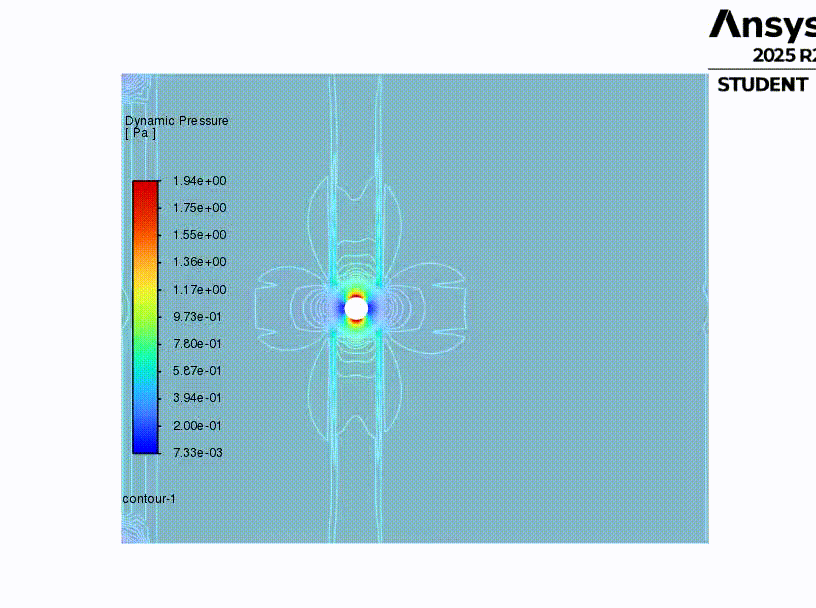
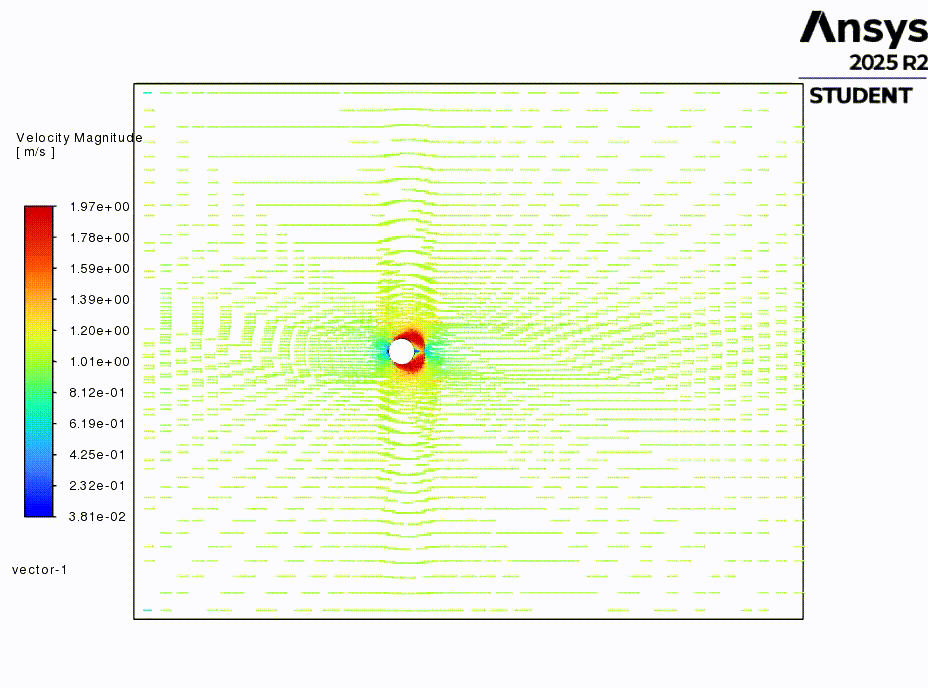

# CFD Notebook Repository

This repository collects CFD-related Jupyter notebooks and ANSYS project files for various concepts.

**Notebooks**

| Notebook | Description |
|---|---|
| `1d-convective-heat-transfer.ipynb` | Derivations and worked numerical examples for 1D convective heat transfer. |
| `1d-heat-diffusion.ipynb` | Theory and numerical experiments for 1D heat conduction (finite-difference examples). |
| `1d_convection_diffusion.ipynb` | Numerical methods and examples for 1D convection–diffusion equations. |
| `1d_unsteady_heat_conduction.ipynb` | Transient heat conduction: time-dependent thermal diffusion and numerical solutions. |
| `fluid_kinematics.ipynb` | Core concepts with visualizations: velocity fields, deformation, and strain rates. |
| `unsteady_couette_flow.ipynb` | Transient Couette flow: analytical solutions and time-dependent simulations. |

**`ansys/`** — ANSYS project and design archives. First-level folders (projects) inside `ansys/`:

| Folder | Description |
|---|---|
| `ansys/manifold_files/` | Generated project files for the manifold design case. |
| `ansys/mixing-pipe-t_files/` | Generated project files for the mixing T-pipe case. |
| `ansys/pipe-cfd_files/` | Generated project files for the `pipe-cfd` case (meshes, Fluent outputs, designPoint). |
| `ansys/pipe-contraction_files/` | Generated project files for the `pipe-contraction` case. |
| `ansys/pipe-mixing-t_files/` | Generated project files for the `pipe-mixing-t` case. |
| `ansys/pipe-with-bend.dsco_files/` | Generated project files for the `pipe-with-bend` case. |
| `ansys/pipe-with-thinkness_files/` | Generated project files for the `pipe-with-thinkness` case. |
| `ansys/plates_files/` | Generated project files for the parallel plates case. |
| `ansys/transient-flow_files/` | Generated project files for the transient flow case. |
| `ansys/transient-flow-modelling_files/` | Generated project files for transient flow modelling. |
| `ansys/Turbulence_files/` | Generated project files for turbulence modelling. |
| `ansys/wheel-assembly_files/` | Generated project files for the wheel assembly case. |

**`differencing_schemes/`** — Numerical discretization schemes for CFD:

| Notebook | Description |
|---|---|
| `differencing_schemes/hybrid.ipynb` | Hybrid differencing scheme combining upwind and central differences. |
| `differencing_schemes/quick.ipynb` | QUICK (Quadratic Upstream Interpolation for Convective Kinematics) scheme. |
| `differencing_schemes/upwind.ipynb` | Upwind differencing scheme for convection-dominant flows. |

**Demos**

**Contour Animation** — Scalar field evolution:

**Vector Animation** — Velocity/gradient field dynamics:

