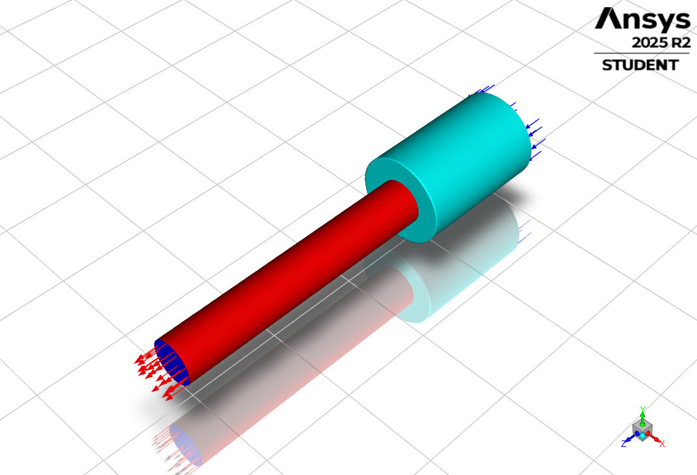

# CFD Notebook Repository

This repository collects CFD-related Jupyter notebooks and ANSYS project files used for study and experiments.

**Notebooks**

| Notebook | Description |
|---|---|
| `1d-convective-heat-transfer.ipynb` | Examples and notes on 1D convective heat transfer problems. |
| `1d-heat-diffusion.ipynb` | 1D heat diffusion (conduction) theory and numerical solutions. |
| `fluid_kinematics.ipynb` | Fundamentals of fluid kinematics: velocity fields, deformation, and strain rates. |
| `unsteady_couette_flow.ipynb` | Transient (unsteady) Couette flow analysis and example solutions. |

**`ansys/`** — ANSYS project and design archives. First-level folders (projects) inside `ansys/`:

| Folder | Description |
|---|---|
| `ansys/pipe-cfd_files/` | Generated project files for the `pipe-cfd` case (meshes, Fluent outputs, designPoint). |
| `ansys/pipe-contraction_files/` | Generated project files for the `pipe-contraction` case. |
| `ansys/pipe-with-bend.dsco_files/` | Generated project files for the `pipe-with-bend` case. |
| `ansys/pipe-with-thinkness_files/` | Generated project files for the `pipe-with-thinkness` case. |

